# Spring mvc + Spring data jpa using Kotlin

This is an example project using Spring mvc + Kotlin monitoring tracing (Spring Sleuth
Zipkin) and metrics (Spring Micrometer with Prometheus)

## Prerequisites

* Java 17+
* Maven 3 installed.

## Configure Grafana Prometheus environment

* Use docker compose services main/resource including several containers:

* Grafana: http://localhost:3000
* Prometheus: http://localhost:9090
* Zipkin: http://localhost:9411/

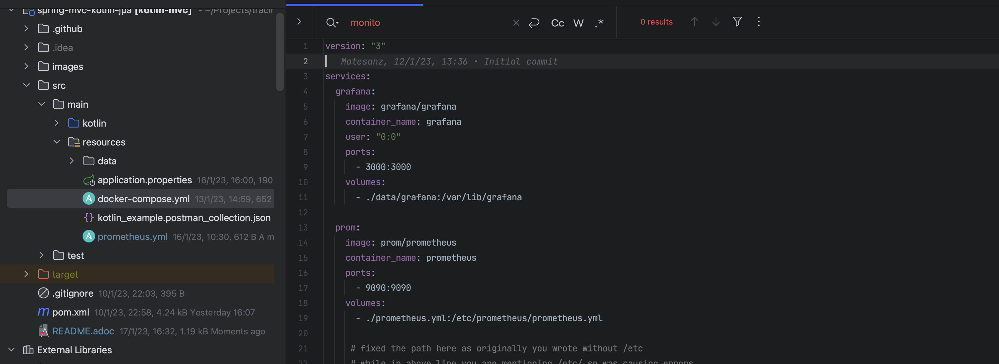

* Change targets defined in prometheus.yml (<spring-boot-application-ip>:<spring-boot-port> of your localhost)

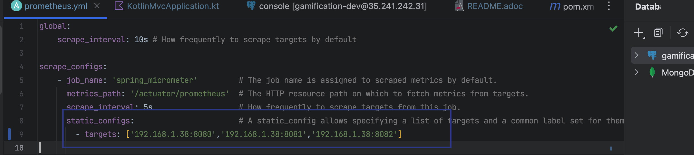

* Run docker-compose up (main/resources)

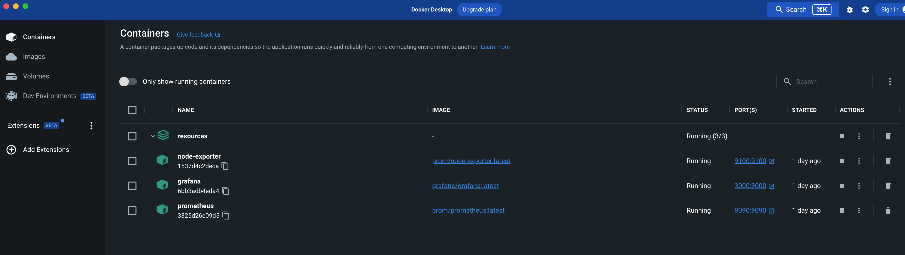

* Run Spring boot application

* Check Spring boot log sending actuator information to Prometheus

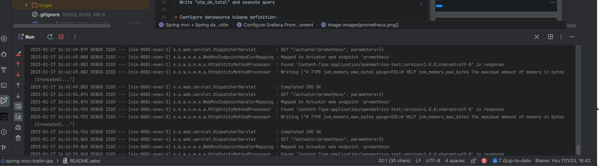

   GET "/actuator/prometheus", parameters={}

* Check Prometheus receive actuator info (http://localhost:9090/):

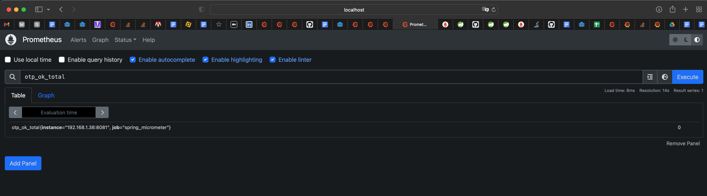

  Write "otp_ok_total" and execute query

* Configure datasource kibana definition:

    URL --> http://prometheus:9090

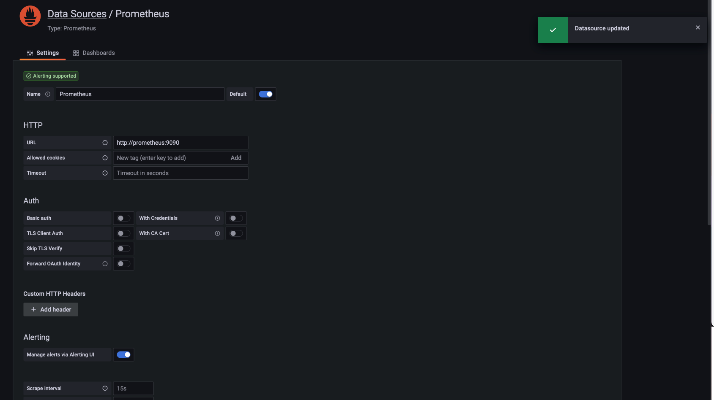

NOTE: prometheus server name must be the same defined  prometheus container name defined in docker-compose yml

* Configure Spring Micrometer Dashboard (4701)

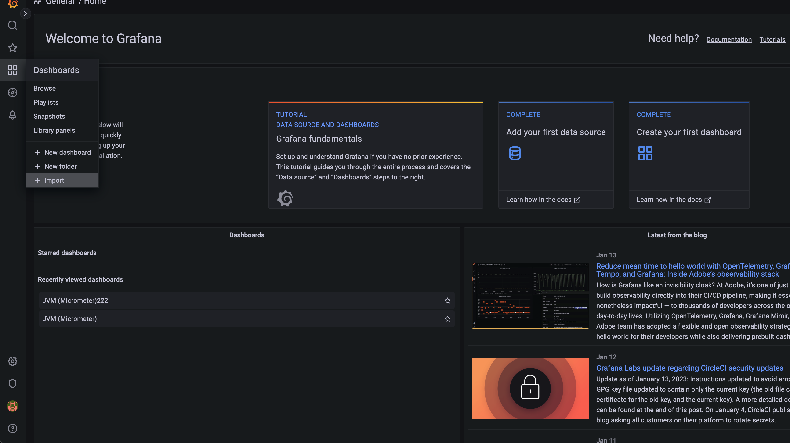
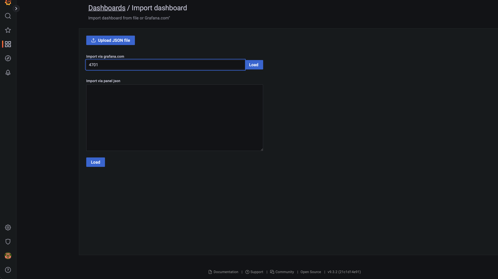
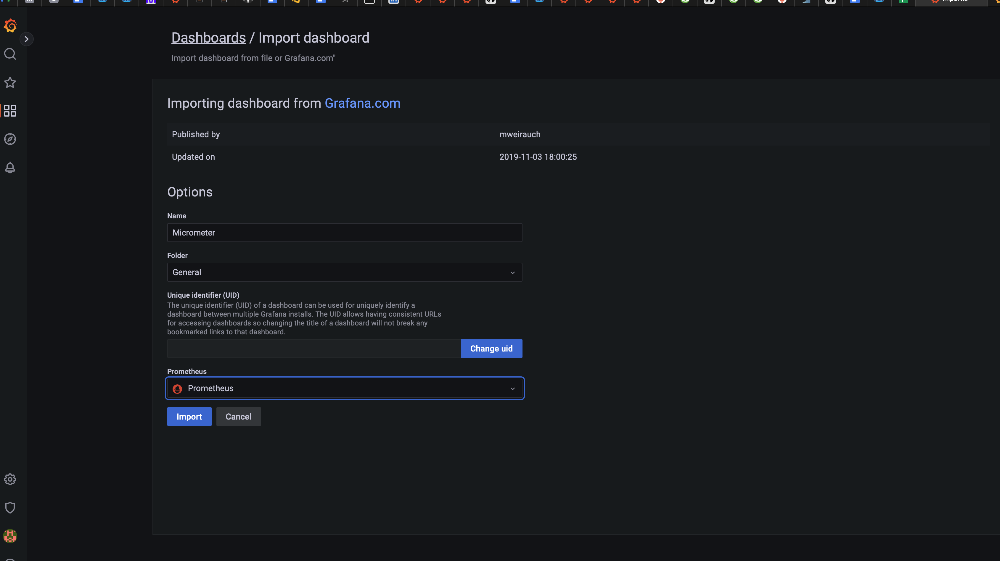

* Test your metrics creating serveral http calls to
      ** http://localhost:8081/message/ok
      ** http://localhost:8081/message/ko
      ** http://localhost:8081/message/exception

* Add graphics using otp_ok_total/otp_ko_total metrics

** show all otp_ok operations 1 minute

  floor(sum(increase(otp_ok_total[1m])))

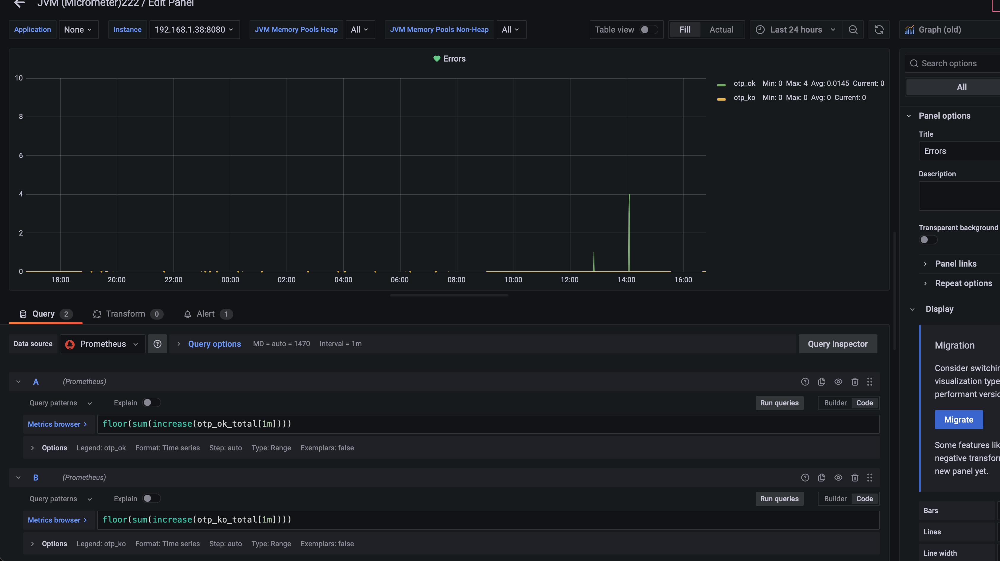

** show all http code endpoints calls (count)

increase(http_server_requests_seconds_count{}[1m])
{{status}} {{method}} {{uri}}

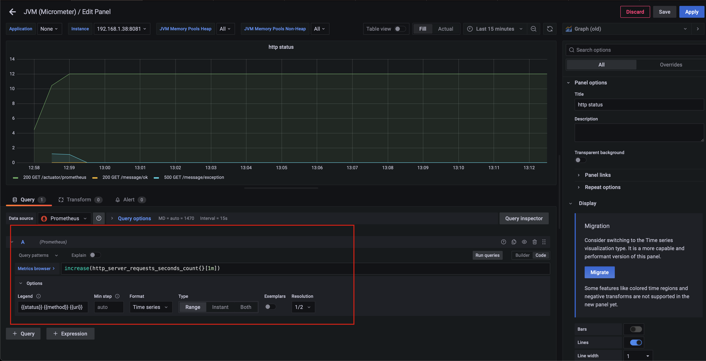

** show all http request code endpoints detailed info (count)

increase(http_server_requests_seconds_count{}[1m])
legend : Auto

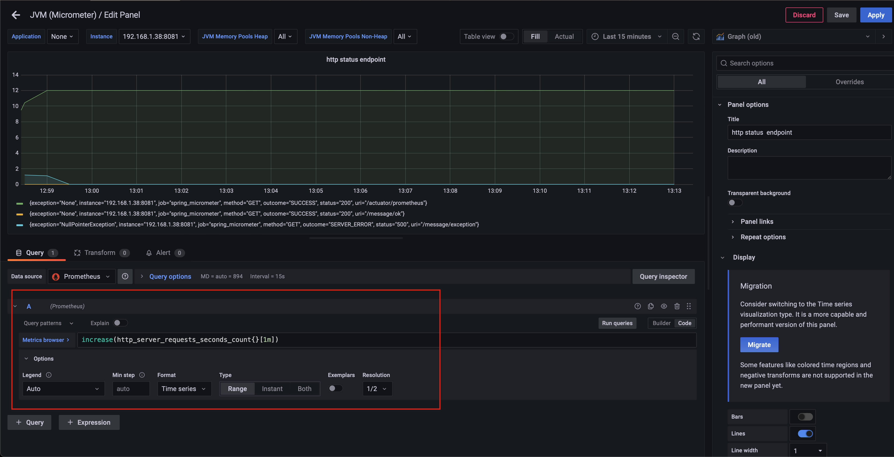

** show all http request group by status  (count)

sum(increase(http_server_requests_seconds_count{}[1m])) by (status)
increase(http_server_requests_seconds_count{}[1m])
legend {{status}}

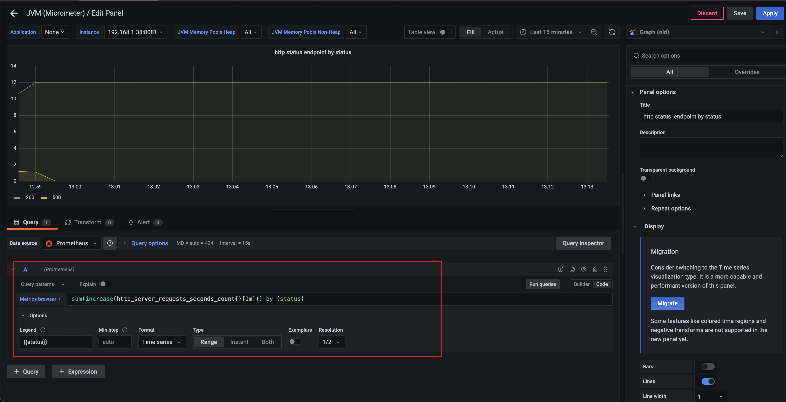

* Test Zipkin tracing

Open http://localhost:9411/ and get last 15 minutes tracing info ordered by

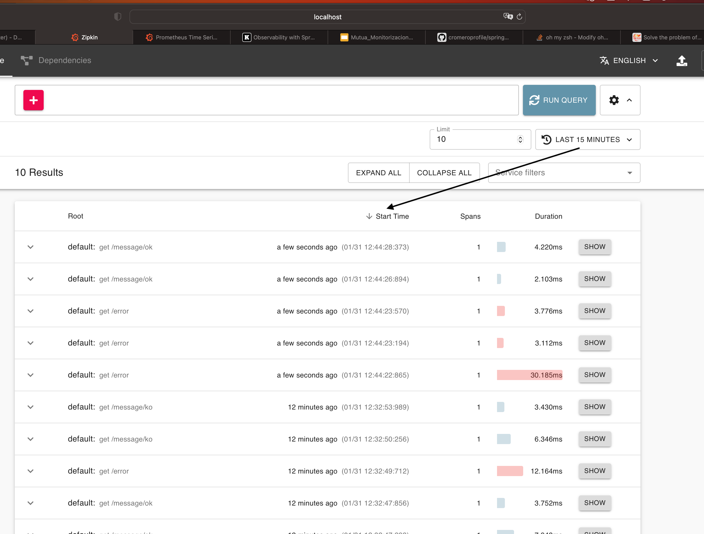
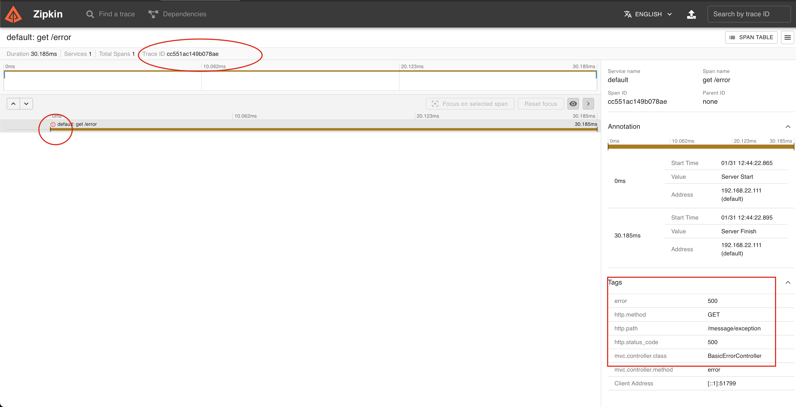
