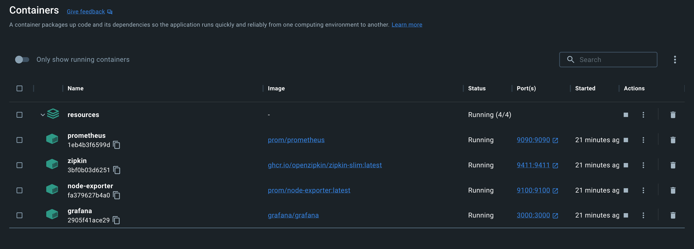

# Spring mvc + Spring data jpa using Kotlin

This is an example project using Spring mvc and  Spring data jpa using Kotlin.

## Prerequisites

* Java 17+
* Maven 3 installed.

## Configure Grafana Prometheus enviroment

* Use docker compose services main/resource (Grafana-Prometheus)

* Change targets defined in prometheus.yml (<spring-boot-application-ip>:<spring-boot-port> of your localhost)

image::images/targets.png[]

* Run docker-compose up (main/resources)

* Run Spring boot application

* Check Spring boot log sending actuator information to Prometheus

image::images/app-log.png[]

   GET "/actuator/prometheus", parameters={}

* Check Prometheus receive actuator info (http://localhost:9090/):

image::images/prometheus.png[]

  Write "otp_ok_total" and execute query

* Configure datasource kibana definition:

    URL --> http://prometheus:9090

NOTE: prometheus server name must be the same defined  prometheus container name defined in docker-compose yml

* Configure Spring Micrometer Dashboard (4701)

image::images/import-1.png[]

* Test your metrics creating serveral http calls to
      http://localhost:8081/message/ok
      http://localhost:8081/message/ko

* Add graphics using otp_ok_total/otp_ko_total metrics

Query example floor(sum(increase(otp_ok_total[1m])))

